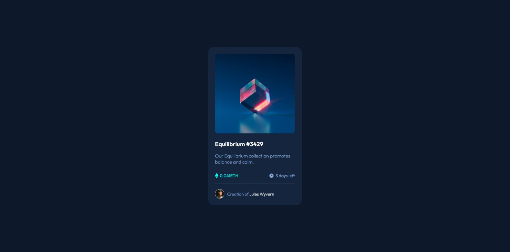

# Frontend Mentor - NFT preview card component solution

This is a solution to the [NFT preview card component challenge on Frontend Mentor](https://www.frontendmentor.io/challenges/nft-preview-card-component-SbdUL_w0U). Frontend Mentor challenges help you improve your coding skills by building realistic projects. 

## Table of contents

- [Overview](#overview)
  - [Screenshot](#screenshot)
  - [Links](#links)
- [My process](#my-process)
  - [Built with](#built-with)
  - [What I learned](#what-i-learned)
  - [Continued development](#continued-development)
  - [Useful resources](#useful-resources)
- [Author](#author)
- [Acknowledgments](#acknowledgments)

## Overview

### Screenshot



### Links

- Solution URL: [Add solution URL here](https://your-solution-url.com)
- Live Site URL: [NFT card component deployed solution](https://osmond20.github.io/NFT-card-compenent/)

## My process

### Built with

- Semantic HTML5 markup
- CSS custom properties
- Flexbox
- CSS Grid
- Mobile-first workflow
- SASS

### What I learned

This section I learned to import dedicated fonts used on only for the project from google web fonts helper. I also learned how to use absolute positioning to apply a hover state in the same position as the NFT image.

To see how you can add code snippets, see below:

```css
/*fonts*/
/* outfit-300 - latin */
@font-face {
  font-display: swap; /* Check https://developer.mozilla.org/en-US/docs/Web/CSS/@font-face/font-display for other options. */
  font-family: "Outfit";
  font-style: normal;
  font-weight: 300;
  src: url("fonts/outfit-v15-latin-300.woff2") format("woff2"); /* Chrome 36+, Opera 23+, Firefox 39+, Safari 12+, iOS 10+ */
}

/*absolute positioning*/
```css
.view-container {
  border-radius: 10px;
  display: flex;
  justify-content: center;
  align-items: center;
  position: absolute;
  inset: 0;
  width: inherit;
  background-color: var(--cyan-400);
  height: inherit;
  opacity: 0;
  transition: opacity 0.3s ease;
}
```

### Continued development

Will be looking to get more better at CSS grid, flexbox and responsive design.

### Useful resources

- [Google Web Fonts Helper](https://gwfh.mranftl.com/fonts)
- [Clamp calculator](https://royalfig.github.io/fluid-typography-calculator/) - Useful for calculating clamp without using media queries
- [PerfectPixel](https://chromewebstore.google.com/detail/perfectpixel-by-welldonec/dkaagdgjmgdmbnecmcefdhjekcoceebi)- helps code the project more closely to its design.

## Author

- Website - [osmond20](https://github.com/osmond20)
- Frontend Mentor - [@osmond20](https://www.frontendmentor.io/profile/osmond20)

## Acknowledgments

Big thanks to Elmar Chavez ([Frontend Mentor Profile](https://www.frontendmentor.io/profile/CodingWithJiro)) in one of my previous project, he provided useful feedback and pointed out improvements I could make to my code and I am grateful to have received it because I got to apply it in this project and got to learn more.
